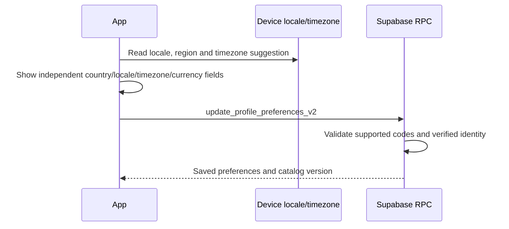
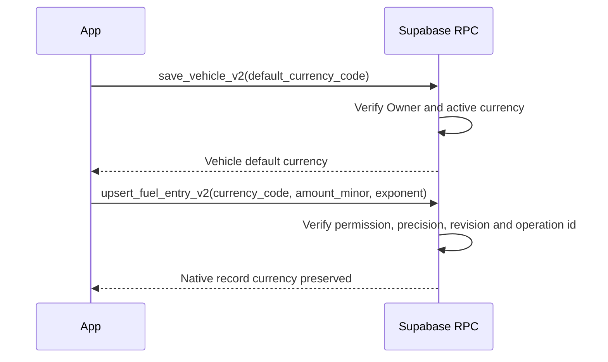
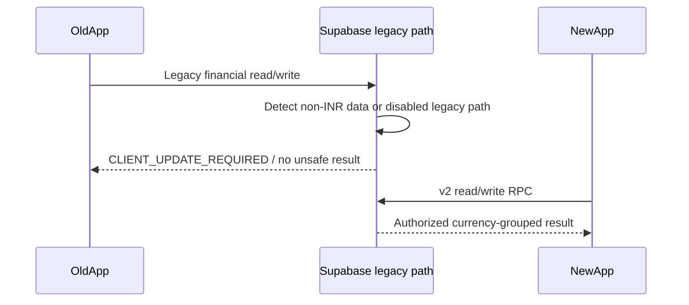
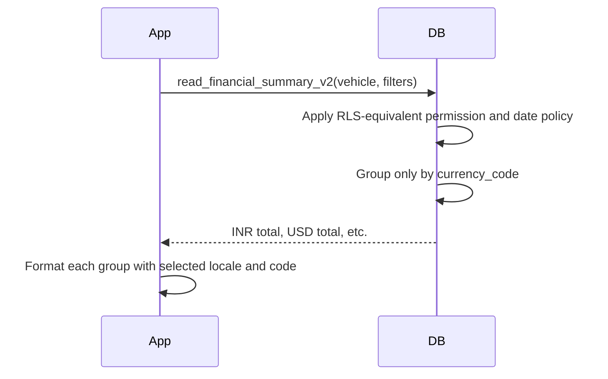

# International flows

## New account setup

```mermaid
sequenceDiagram
  participant App
  participant Device as Device locale/timezone
  participant DB as Supabase RPC
  App->>Device: Read locale, region and timezone suggestion
  App->>App: Show independent country/locale/timezone/currency fields
  App->>DB: update_profile_preferences_v2
  DB->>DB: Validate supported codes and verified identity
  DB-->>App: Saved preferences and catalog version
```

## New vehicle and record

```mermaid
sequenceDiagram
  participant App
  participant DB as Supabase RPC
  App->>DB: save_vehicle_v2(default_currency_code)
  DB->>DB: Verify Owner and active currency
  DB-->>App: Vehicle default currency
  App->>DB: upsert_fuel_entry_v2(currency_code, amount_minor, exponent)
  DB->>DB: Verify permission, precision, revision and operation id
  DB-->>App: Native record currency preserved
```

## Legacy-client gate

```mermaid
sequenceDiagram
  participant OldApp
  participant DB as Supabase legacy path
  participant NewApp
  OldApp->>DB: Legacy financial read/write
  DB->>DB: Detect non-INR data or disabled legacy path
  DB-->>OldApp: CLIENT_UPDATE_REQUIRED / no unsafe result
  NewApp->>DB: v2 read/write RPC
  DB-->>NewApp: Authorized currency-grouped result
```

## Currency-grouped reporting

```mermaid
sequenceDiagram
  participant App
  participant DB
  App->>DB: read_financial_summary_v2(vehicle, filters)
  DB->>DB: Apply RLS-equivalent permission and date policy
  DB->>DB: Group only by currency_code
  DB-->>App: INR total, USD total, etc.
  App->>App: Format each group with selected locale and code
```
